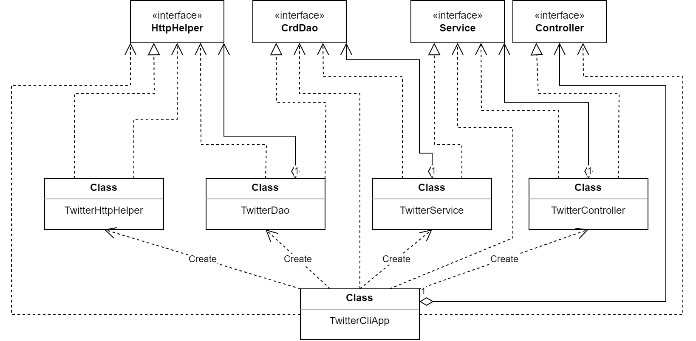

# Introduction
The Twitter app allows users to post, lookup, and delete tweets through the CLI using the packaged jar file that can be created using this project.  This was accomplished by following a restful design for the application and using Twitter REST API as a starting point.  Once the user has access to the Twitter REST API, by creating a Twitter dev account with elevated access and taking note of the tokens and keys, they will be able to set up environment variables using these tokens and use the apps post, show, delete commands accordingly. 

The app uses the HTTP client builder to execute post and get requests that will be sent to the Twitter app.  A DAO was used to manage these requests using a Tweet DTO that transferred the necessary data to and from the HTTP requests/responses from the REST API.  A few libraries were used to help manipulate string data and DTO to strings using a JSON parser. 

When all the classes were implemented, they were tested using JUnit and Mockito to ensure proper functionality and behavior.

Finally, the app was packaged using maven into an Uberjar with Springboot implemented to manage all the app's dependencies for us. 

Now the app can be run in a docker container from the CLI by supplementing it with the proper tokens and using the image that is available on the docker hub

[Docker image](https://hub.docker.com/repository/docker/apivato21/twitter)

# Quick Start
- Package app using Maven:
```
mvn clean package -Dmaven.test.skip=true
#the test phase should be skipped to avoid running all tests that send off extra tweets to the API very quickly which can result in a policy violation if Twitter is unaware that they are tests.  if you wish to run tests, feel free to do so by omitting the last option in the command.
```
- Running the application using Docker:
```
#pull docker image or build it using the Dockerfile
docker pull ${Docker_user}/twitter
docker build -t ${Docker_user}/twitter .

#to run the image in a container to execute app commands

#posting a tweet
#Usage : TwitterApp "post" "tweet_text" "latitude:longitude"

docker run --rm \
-e consumerKey=YOUR_VALUE \
-e consumerSecret=YOUR_VALUE \
-e accessToken=YOUR_VALUE \
-e tokenSecret=YOUR_VALUE \
${docker_user}/twitter post "test" "43:79"

#find tweet by id
#Usage: TwitterApp show tweet_id [field1,fields2] (fields are Twitter DTO fields to be queried for specifically)

docker run --rm \
-e consumerKey=YOUR_VALUE \
-e consumerSecret=YOUR_VALUE \
-e accessToken=YOUR_VALUE \
-e tokenSecret=YOUR_VALUE \
jrvs/twitter_app show 1276568976764686343

#delete tweet/s
#Usage :  TwitterApp delete [id1,id2,..] (can delete multiple tweets at once)

docker run --rm \
-e consumerKey=YOUR_VALUE \
-e consumerSecret=YOUR_VALUE \
-e accessToken=YOUR_VALUE \
-e tokenSecret=YOUR_VALUE \
jrvs/twitter_app delete 1200145224103841792
```

# Design
## UML diagram


- **App/Main**:

    Responsible for declaring and instantiating all components and calling the run method which calls the corresponding controller method according to user input.   

- **HttpHelper**:

    The HttpHelpers is responsible for executing HTTP requests with a given URI while also authorizing these requests using Twitter secrets.

- **Dao**:

    The data access layer handles the Tweet model objects (DTO) and processes the post, show, and delete tweet operations with the Twitter API.

- **Service**:

    the service layer will handle all business logic and calls the DAO layer to interact with the underlying service of the Twitter REST API.

- **Controller**:

    The controller layer interacts and parses user input (CLI arguments) then calls the service layer and returns its results.

## Models
The Tweet DTO model consists of the following to manage the Tweet data:

- **Tweet** object contains the following states:

    - created_at: date and time of tweet post

    - id: unsigned i64 bit int id for the tweet object

    - id str: str version of id so that conversion doesn't lose any information

    - text: post text, main content 

    - entities: entity object 

    - coordinates: coordinate object

    - retweet count: total retweet count

    - favorite count: total favorite count

    - favorited: boolean of if it was favorited

    - retweeted: boolean of if it was retweeted

- **Entities** object contains the following states:

    - Hashtags: hashtag object

    - User mentions:  user mentions the object

- **Hashtag** object contains the following states:

    - indices:  indices in the main content within the string

    - text: text of hashtag itself

- **UserMention** object contains the following states:

    - name: name of the user mentioned

    - indices: indices of the name located in the main content string

    - screen name = screen name of the user mentioned

    - id: id of the user mentioned

    - id str:  id str of the user mentioned

- **Coordinates** object contains the following states:

    - coordinates: list of longitude and latitude coordinates

    - type: type of coordinates that are stored e.g: point for exact location

## Spring
- The project's dependencies were handled using Spring, more specifically spring-boot added to the maven POM file, to ensure all dependencies were set up properly when the app was run.  This way when the Maven project was packaged, and later run, we don't have to worry about all the class objects not being set up properly and the app's dependencies not existing.

- This was accomplished using the component scan approach.  Annotations were used to inform the IoC container which objects needed to be injected without needing any additional class files to do so.  Once this was accomplished, Spingboot handles the rest, and the IoC container executes the main run method accordingly.

# Test
Every class object was tested in the following ways:
- integration tests to ensure that the objects were functioning correctly with each other and exceptions were handled.
- Unit tests using Mockito were done to ensure proper object behaviors by mocking their input and output to see if the methods would behave any differently.

## Deployment
The app was dockerized by creating a Dockerfile as follows:
```
FROM openjdk:8-alpine
COPY target/twitter*.jar /usr/local/app/grep/lib/twitter.jar
ENTRYPOINT ["java","-jar","/usr/local/app/grep/lib/twitter.jar"]
```
once the Dockerfile was created, simply create the docker image and push it to the docker hub repository, after logging in, to allow for easy deployment
```
docker build -t ${Docker_user}/twitter .
docker push ${Docker_user/twitter}
```
Once a user has successfully obtained the Docker image, they can run the app through a Docker container without needing to worry about anything.

# Improvements
- I would like to improve exception management from the Twitter API so enable more easily understood error messages in cases of being blocked due to being considered a bot.
- I would have implemented a way to have all the tweets of a user be pulled as well, just another get request method.
- I would like to have a verbose mode switch so that if the user chooses they may have all the logs printed as the app is run or not.
