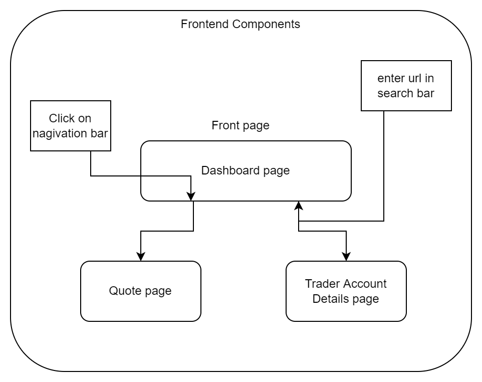

# Introduction
After building the Springboot trading app backend that uses IEX cloud and JDBC APIs to provide trading information to the users, it was time to create the frontend of the application which would display the data obtained in a more legible format.  This app was made for users that would want to keep track of the traders on the app and their trader details, the daily list of tickers that they would be keeping track of, and be able to deposit and withdraw funds from their accounts.  Essentially one tool that allows users to manage their orders and for the admin to manage users. 

This front end was completed by using HTML, SCSS, JavaScript, and React, along with the necessary libraries used to create functional webpages; antd and Axios, as the basis of the project. the project was built using npm and node.js to automate building and dependency management. 

# Quick Start

* os used for testing is Centos7, some bugs were encountered when running on Debian-based Linux distros.

- Ensure you have docker set up and can clone this repo and the Springboot Trading app project to obtain front end app and the backend's docker files so that you can create the images required for starting the backend.
```
git clone <insert Springboot GitHub code ssh or URL here>

```
[visit the projects Github page to learn how to set up images](https://github.com/jarviscanada/jarvis_data_eng_AmosPivato/tree/develop/springboot)

- Have up & running docker image of backend application (provide docker image)
```
#set up IEX token and psql docker container and backend app docker container

#start psql instance and instantiate database
docker run --rm --name trading-psql-local \
-e POSTGRES_PASSWORD=password \
-e POSTGRES_DB=jrvstrading \
-e POSTGRES_USER=postgres \
--network trading-net \
-d -p 5432:5432 trading-psql

#set up your IEX API token
IEX_PUB_TOKEN="YOUR_TOKEN"

#start the docker container for the trading app (add -d option for non-verbose)
docker run -d --rm --name trading-app-local \
-e "PSQL_HOST=trading-psql-local" \
-e "PSQL_PORT=5432" \
-e "PSQL_USER=postgres" \
-e "PSQL_DB=jrvstrading" \
-e "PSQL_PASSWORD=password" \
-e "IEX_PUB_TOKEN=${IEX_PUB_TOKEN}" \
--network trading-net \
-p 8080:8080 -t trading-app

```
- Install node & npm 
```


#add nodesource to yum repository
curl -sL https://rpm.nodesource.com/setup_10.x | sudo bash -

#install nodejs and npm package
sudo yum install nodejs

#verify node and npm versions and that they were installed correctly
node --version

npm --version

```
[for more information visit this link](https://linuxize.com/post/how-to-install-node-js-on-centos-7/)

- Run npm start

```
#once these are installed, navigate to the trading-UI app directory that was cloned from GitHub and run:

npm install

# finally once this is complete you will be able to start the project

npm start
```

# Implemenation
This project was implemented by first running npx create-react-app *title*.  What followed was the creation of the main Dashboard page and its components.  This was done to allow for the app to have a centralized page where multiple functionalities could be accessed, such as the quote page, trader Account page, and then the add trader, and funds management forms.  

By ensuring each component functioned properly, I was able to effectively manage and implement the entire front end in a component-based architecture.  This was possible because Routing was implemented into the app to ensure each request or action/click would lead to the correct corresponding component or page.  This also made it a lot easier to manage to implement the forms and buttons for data management or page navigation as I knew where everything was supposed to be implemented.

As for styling, SASS was used to manage styling in a more object-oriented fashion as well as allowing for less repetitive CSS.


## Architecture


# Test
This app was tested by using React and ensuring the frontend functioned correctly with the backend by testing each of its connections, and also by making sure the app had the correct appearance for an MVP.

# Deployment
This app was deployed onto GitHub as an easy means for users to clone the source code and with npm easily install the project app and run it using npm start along with the backend which is also deployed on Github to be cloned as well.

# Improvements
- Have a button that would take you from a trader to its account view to manage its funds
- Make navbar collapsable
- Add more color to the styling