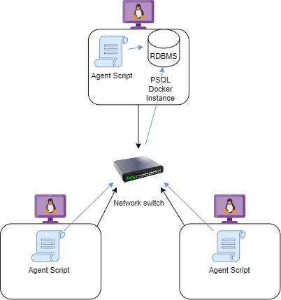

# Introduction
This Linux cluster monitoring agent allows for easy LCA node cluster hardware recording and resource monitoring. Monitoring agent scripts and an RDBMS are used to store all the node's data which is then used to create reports for future resource planning.

# Quick Start
Commands to operate scripts (be sure to check that scripts have execute permissions)
- Using psql_docker.sh
    - Creating a new PSQL docker container instance if it doesn't exist
        ```
        ./scripts/psql_docker.sh create username password
        ```
    - Starting the PSQL docker container
        ```
        ./scripts/psql_docker.sh start
        ```
    - Stopping the PSQL docker container
        ```
        ./scripts/psql_docker.sh stop
        ```

*note: docker container must be started at this point*

- Create Host agent tables using ddl.sql
    ```
    psql -h localhost -U postgres -d host_agent -f sql/ddl.sql -W
    ```
- Insert hardware specs data into the DB using host_info.sh
    ```
    ./scripts/host_info.sh localhost 5432 host_agent postgres password*
    ```
- Insert hardware usage data into the DB using host_usage.sh
    ```
    ./scripts/host_usage.sh localhost 5432 host_agent postgres password*
    ```
- Crontab setup (edit crontab jobs and install the following to run host_usage.sh every minute and update host_usage table consistently)
    ```
    * * * * * bash /home/centos/dev/jarvis_data_eng_Amos/linux_sql/scripts/host_usage.sh "localhost" 5432 "host_agent" "postgres" "password" > /tmp/host_usage.log
    ```

*where password is the password for the PSQL database

# Implemenation
This project was implemented in five parts:

1. Identifying the Linux CLI commands that would provide the monitoring agent with the hardware specs and usage data we require. (can be found in the commands file in scripts)
2. Implementing an automated PSQL docker container set up and control script to manage and operate the docker container that will hold the PSQL database instance.
3. Creating DDL commands that create the required table schema for the RDBMS to manage the hardware and usage data that will be passed into it.
4. Implementing and testing automated monitoring agent scripts Host_info.sh and Host_usage.sh such that they will correctly run the CLI commands we previously designed to obtain the hardware specs and usage data we want and then send it to the PSQL database tables in the docker container.  Ensuring as well that the Host_usage.sh script functions every minute using crontab.
5. Designing and testing SQL queries using table data to provide information that answers specific business questions.

## Tech Stack
This project uses the following technologies:

- Docker
- Postgresql
- Linux CLI commands, Bash scripting, and crontab

## Architecture



## Scripts

- **psql_docker.sh**
    - Description:

        The script is responsible for the creation, starting, and stopping of the PSQL instance using docker containers.  
        CLI commands are automated in this bash script to check whether a PSQL container instance is created or not and if not will create one, and the pgdata volume if it also doesn't exist, for the LCA node.  
        If specified to start or stop a container, it will first check whether the container exists and if so will run the docker start/stop commands for the PSQL instance.
    - usage:
    ```
    #syntax
    ./scripts/psql_docker.sh command argument#1 argument#2 

    eg:
    #to create PSQL container instance and set password and username
    ./scripts/psql_docker.sh create username password 

    #to start the container
    ./scripts/psql_docker.sh start

    #to stop the container
    ./scripts/psql_docker.sh strop
    ```
- **host_info.sh**
    - Description:

        This script is responsible for obtaining the current node's hardware specs and sending them to the PSQL RDBMS over the local network.
        It will begin by checking that the correct command-line arguments have been provided, and then proceed to retrieve all the necessary node hardware specs through CLI commands.
        It then creates a SQL statement using all these pieces of information and will then run a PSQL command to send the insert statement query with all the data to the host agent database and save it in the host_info table.
    - usage:
    ```
    #syntax
    ./scripts/host_info.sh psql_host psql_port db_name psql_user psql_password

    eg:
    ./scripts/host_info.sh localhost 5432 host_agent postgres password
    ```
- **host_usage.sh**
    - Description:

        This script is responsible for obtaining the current node's hardware usage data and sending them to the PSQL RDBMS over the local network.
        It will begin by checking that the correct command-line arguments have been provided, and then proceed to retrieve all the necessary node hardware usage data through CLI commands.
        It then creates an SQL insert statement using all these pieces of information and will then run a PSQL command to send the insert statement query with all the data to the host agent database and save it in the Host_usage table.
    - usage:
    ```
    #syntax
    ./scripts/host_usage.sh psql_host psql_port db_name psql_user psql_password

    eg:
    ./scripts/host_usage.sh localhost 5432 host_agent postgres password
    ```
- **crontab**
    - Description:

        This job is installed into the crontab scheduler such that the host_usage.sh file will be executed every minute and allow the LCA node cluster RDBMS to be updated consistently and allow for the members to be able to monitor the nodes accurately.
    - usage:
    ```
    #open up crontab editor to add new job
    crontab -e
    
    #add the this line to instal new job that crontab will execute repeatedly
    * * * * * bash /home/centos/dev/jarvis_data_eng_Amos/linux_sql/scripts/host_usage.sh "localhost" 5432 "host_agent" "postgres" "password" > /tmp/host_usage.log
    format: * * * * * command to run with arguments that are needed > log ouput dir

    #to see current crontab jobs
    crontab -l
    ```
- **queries.sql** 
    - Description:
        
        This file will is run through the PSQL host agent docker instance and will run the queries it is provided with.
        current business problems it is answering are as follows, in this order:
        - Group hosts by hardware information; 

            letting us see which hosts have the most memory or least memory, by the number of CPUs they contain.
        - Average memory usage; 
            
            allowing members to see how much memory on average each host machine is using every five-minute interval
        - Detect host failure; 
            
            provide members with insight into how the monitoring agent is doing by retrieving the number of entries that host_usage.sh enters over a five minutes interval, if its less than 3 entries then we consider it an error, and this query will bring it up.
    - usage:
    ```
    #syntax
    psql -h host_name -p port_number -U user_name -d DB_name -f file_name -W (password check enforced)

    eg:
    psql -h localhost -U postgres -d host_agent -f sql/queries.sql -W
    ```

## Database Modeling

Host_agent table Schema's (both tables are public):

- `host_info` 

    |***desc***| ID | hostname | cpu_number | cpu_architecture | cpu_model | cpu_mhz | L2_cache | total_mem | timestamp |
    |---| ---|   ---    |    ---     |       ---        |    ---    |   ---   |   ---    |    ---    |    ---    |
    |constraint | Serial Not Null Primary Key | Varchar Unique Not Null | Integer Not Null | Varchar Not Null | Varchar Not Null | Float Not Null | Integer Not Null | Integer Not Null | Timestamp Not Null |
    |value | ID of host | name of host | hosts CPU cores | host CPU architecture | host CPU model | host CPU speed | host CPU L2 cache in KB | host's total memory in KB | Timestamp of when info/script was executed in UTC |

- `host_usage`

    |***desc***| timestamp | host_id | memory_free | cpu_idle | cpu_kernel | disk_io | disk_available |
    | --- | ---|   ---    |    ---     |       ---        |    ---    |   ---   |   ---    |
    |constraint | Timestamp Not Null | Serial Not Null Referencing host_info ID | Integer Not Null | Integer Not Null | Integer Not Null | Integer Not Null | Integer Not Null |
    |value |  Timestamp of when usage/script was executed in UTC | Foreign key id of host node | amount of free memory in MB | percentage of CPU that is idle | percentage of CPU running kernel | number of I/O signals | amount of total storage available in MB |

# Test

Testing was conducted as follows:

- Tested individual CLI commands for each of the required table fields to ensure that they returned the required information in the correct format.  Resulting in multiple corrections made to some commands to improve field data quality.

- Tested repeatedly the PSQL_docker.sh script to ensure that the container could be created properly with the correct volumes by checking the volume that exists before creation and that it will avoid creating a new container when it already exists.  As well as repeatedly testing the start and stop commands to ensure that they run on a created container and attempt to start a container that doesn't exist.  Resulting in a Script that automates the PSQL docker instance without any bugs.

- Tested host_info.sh and host_usage.sh to ensure that the information is properly sent to the PSQL instance with all constraints satisfied, ran them on varying inputs and SQL files, all of which once formatted correctly, were executed successfully. Resulting in the monitoring agent scripts properly passing on the correct node data without any errors

- Tested queries.sql and ddl.sql by running them through the PSQL instance multiple times to ensure that, the DDL set up the tables correctly and that the queries were run and returned the expected output.  some dummy SQL statements were run as well to test the tables with some dummy data to improve the reliability of the statements.  resulting in the RDBMS tables being set up correctly and the queries obtaining the appropriate information for LCA members.

# Deployment
- This tool was deployed by using git and GitHub as remote storage and version control.
- Crontab was used to ensure script automation is maintained and kept consistent to update the database host_usage table every minute on node performance
- Docker was used to instantiate the PSQL database and be accessible to all nodes on the local network
- GCP virtual machine was used for the development and testing environments

# Improvements
Things I would like to improve:
- Have the monitoring agent scripts and PSQL docker scripts be able to handle software/driver updates to not encounter version compatibility issues in the future 
- have the DDL script check if the tables in the database already exist and if so not run
- have the host_info script check to see if the current node has already been entered in the RDBMS and if so check if any fields need to be updated, in case of hardware updates.
- have the psql_docker script check if the container is started or not when handling start/stop commands
