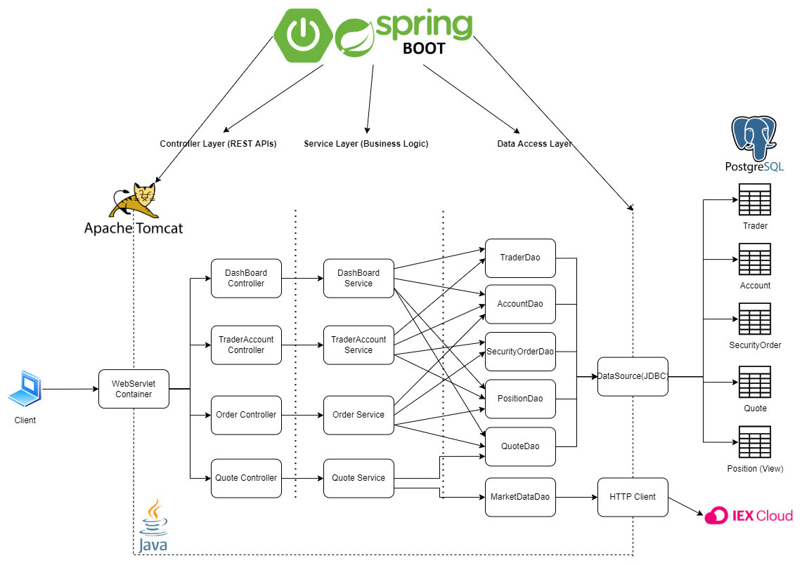
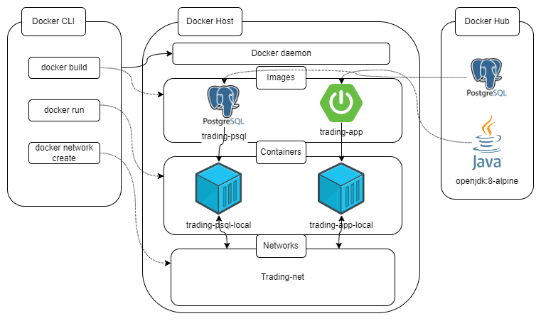

Table of contents
* [Introduction](#Introduction)
* [Quick Start](#quick-start)
* [Implementation](#implemenation)
    * [Architecture](#architecture)
    * [Rest API Usage](#rest-api-usage)
        * [Swagger](#swagger)
        * [Quote Controller](#quote-controller)
        * [Quote Controller](#quote-controller)
        * [Trader Controller](#trader-controller)
        * [Order Controller](#order-controller)
        * [App Controller](#app-controller)
        * [Optional(Dashboard Controller)](#optionaldashboard-controller)
* [Test](#test)
* [Deployment](#deployment)
* [Improvements](#improvements)

# Introduction
- The Jarvis business team wanted to develop a new trading app to replace the difficult-to-scale, monolithic, legacy system.  Therefore I was responsible for developing a new trading app with a microservice architecture using spring-boot, that will be more flexible and easier to scale up.  This PoC does not deal with banking or exchange systems or security, rather this project will focus on feature implementation.
- Used in this project are the following Technologies:
    - Java 8, Maven, and Springboot as the project's base to implement REST API functionality, handle business logic and manage trading profiles, etc...
    - The Springboot application is stateless, all data is persisted in a Postgress database
    - IEX cloud API is used to fetch free market data
    - Swagger UI is used to create a functional client UI
    - JDBC Datasource is used to handle app database transactions
- This PoC can create and manage trader profiles and each account can pull IEX cloud data as well as make trade orders that are persisted in the database.  Market tickers can be saved to a daily list for future trades as well as deleted if no longer needed. Each trader can withdraw and deposit funds into/from their accounts and order positions are kept track of through a position controller to evaluate trade order offers status.

# Quick Start
- Prequiresites: Docker, CentOS 7
- App set up:
```
#be sure to be in the correct directory (/spring-boot)

#build the docker images from the Dockerfiles for the app and SQL intances
docker build -t trading-psql -f ./psql/Dockerfilepsql .
docker build -t trading-app -f Dockerfileapp .

#create the docker network to bridge the two containers
docker network create --driver bridge trading-net

#start the docker container for the psql database
docker run --rm --name trading-psql-local \
-e POSTGRES_PASSWORD=password \
-e POSTGRES_DB=jrvstrading \
-e POSTGRES_USER=postgres \
--network trading-net \
-d -p 5432:5432 trading-psql

#set up your IEX API token
IEX_PUB_TOKEN="YOUR_TOKEN"

#start the docker container for the trading app (add -d option for non-verbose)
docker run -d --rm --name trading-app-local \
-e "PSQL_HOST=trading-psql-local" \
-e "PSQL_PORT=5432" \
-e "PSQL_USER=postgres" \
-e "PSQL_DB=jrvstrading" \
-e "PSQL_PASSWORD=password" \
-e "IEX_PUB_TOKEN=${IEX_PUB_TOKEN}" \
--network trading-net \
-p 8080:8080 -t trading-app


#verify they are running
docker ps

#try the app using Swagger UI (must be on a local machine running the app)
http://localhost:8080/swagger-ui.html

#stop the app just stop the containers
docker container stop trading-app-local trading-psql-local

```

# Implemenation
## Architecture

- **Controller layer**:
This layer ensures that client HTTP requests are received through the web servlet (Tomcat) and executes the correct service layer method based on the request URL.  This part of a RESTfull application allows for the app to efficiently direct requests eg; handlining Order, TraderAccount, or Quote requests by distinguishing their URL components and calling the appropriate service methods to complete the request and send a response to the client.
- **Service layer**:
This layer ensures that the client request has a method that will ensure the correct components are supplied correctly and can be handled with correct business logic.  In this case, being that the orders have correct tickers, TraderAccounts has corrected the correct personal information format, etc...
Once the proper components are confirmed, the service layer creates/sends a class-specific DTO to its accompanying DAO to complete the request.  
- **DAO layer**:
This layer is responsible for taking the class with the correct values contained in the specified DTO, deserializing/serializing the request and response that it will send to the data source or API that is required by the client, and returning the response values.  
- SpringBoot: webservlet/TomCat and IoC
This Layer is responsible for encapsulating the microservice application and contains all of its dependencies using Object bean injection (IoC).  As well as being easy to use the platform to host the application using the WebServlet (Tomcat), it also allows for the capabilities to communicate with data sources and APIs, and clients altogether. 
- **PSQL and IEX**:
These components are used to retrieve IEX cloud data through the IEX API and respond with an XML output of whatever ticker the client may want to see. And to store any of the client's quote, order, or TraderAccount value-changing requests in a PSQL database.  This way the stateless side of the application is kept as any state-changing requests are persisted in the database and not kept on the app and any communication with the API can be isolated and easily maintained, as well as the data manipulation in the data sources free from unwanted interaction with other layers of the app.

## REST API Usage
### Swagger
Swagger can automatically generate a SwaggerUI and API JSON file containing the configurations for the application controllers' endpoints, which can be used in Postman.
We use SwaggerUI and Postman to execute HTTP requests to test and better understand the application's features.
### Quote Controller
- This Controller handles HTTP request from the client and ensure that the response contains quote information from the IEXcloud API or from the PSQL database that stores previous quotes.
- **Endpoints**:
    - GET `/quote/dailylist: Show all tickers that are available to be traded on this platform.
    - GET `/quote/iex/ticker/{ticker}`: find and show iexQuote of ticker {ticker} if it exists.
    - POST `/quote/tickerId/{tickerId}`: Add a new ticker to the daily list by finding a ticker that does not exist in the daily list and persisting it in the database.
    - PUT `/quote/`: Update a given quote in the quote table, this endpoint is for debugging and testing purposes which allows you to manipulate a quote from the quote table manually.
    - PUT `/quote/iexMarketData`: Update the quote table using IEX data by fetching quotes from the IEX cloud and updating all quotes from the quote table compared against the daily list.

### Trader Controller
- This Controller handles HTTP requests from the client to manage Trader Accounts by creating them and/or managing their funds by withdrawing or depositing them.
- **Endpoints**:
    - POST `/trader/firstname/{firstname}/lastname/{lastname}/dob/{dob}/country/{country}/email/{email}`: There are two endpoints that can create a new trader. The first will allows you to create a new trader and its account using the HTTP request body, and the other one allows you to use a URL.
    - PUT `/trader/deposit/traderId/{traderId}/amount/{amount}`: Deposits fund into the specified traders account.
    - PUT `/trader/withdraw/traderId/{traderId}/amount/{amount}`: Withdraws funds from specified traders account.
    - DELETE `/trader/traderId/{traderId}`: Deletes specified trader and its account only if all of its positions are closed and funds are withdrawn.
### Order Controller
- This Controller handles HTTP requests from the client to manage their security orders by creating new ones and adding them to the orders table while making sure that the trader account issues the order exists.
- **Endpoints**:
    - POST `/order/marketOrder`: Submits an order request eg: buy two stocks from aapl.
### App controller
- This Controller checks to see if the app is running and confirms that clients may send it requests.
- **Endpoints**:
    - GET `/health`: tests to see if the app can receive HTTP requests and if the database is also up to handle any data that may need to be updated.
### Optional(Dashboard controller)
- This controller is responsible for handling HTTP requests that ask for displaying trader's profiles or portfolios.
- **Endpoints**:
    - GET `/dashboard/portfolio/traderId/{traderId}`: Show portfolio by trader.
    - GET `/dashboard/profile/traderId/{traderId}`: Show trader profile by trader.

# Test 
The app was tested with a mixture of unit tests and Integration tests to ensure proper behavior and endpoint results.
Junit4 was used for testing as well as Springboot to simplify project building with dependencies through IoC object injections as well as initializing the database used for testing endpoints.
- Line coverage final results: at least 52% or above line coverage was achieved through integration tests. (dashboard and JDBCCrud are implemented but not directly run in the app):


# Deployment

- Docker Images used for deployment:
    - **trading-psql**: This image is built using initialization scripts to host a PSQL database set up and initialized with the correct tables and relationships needed for the app to function.  this is accomplished by having the Dockerfile copy the DDL scripts and run them through the correct entry point when the image is used in a container.
    - **trading-app**: This image is built to convert the trading app java code into bytecode through spring-boot building an uber jar to contain all dependencies in one place.  the image is then able to copy the jar and have it ready at an entry point to run when it is used in a docker container.  and then spring-boot take care of the rest when the app gets executed within the container, all while being able to communicate with the PSQL container through the docker network and with the APIs that are being used.


# Improvements
I would like to improve the following in this app:
- Implement the order controller
- Have the quote DAO be implement using the JDBC-crd DAO template
- have the whole app dockerized into a single image somehow
